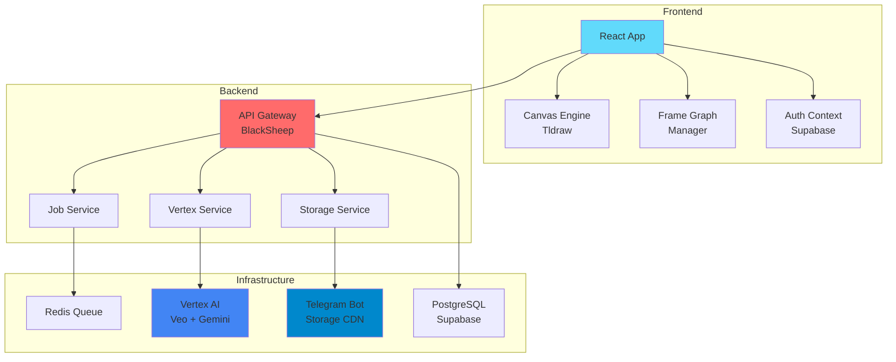
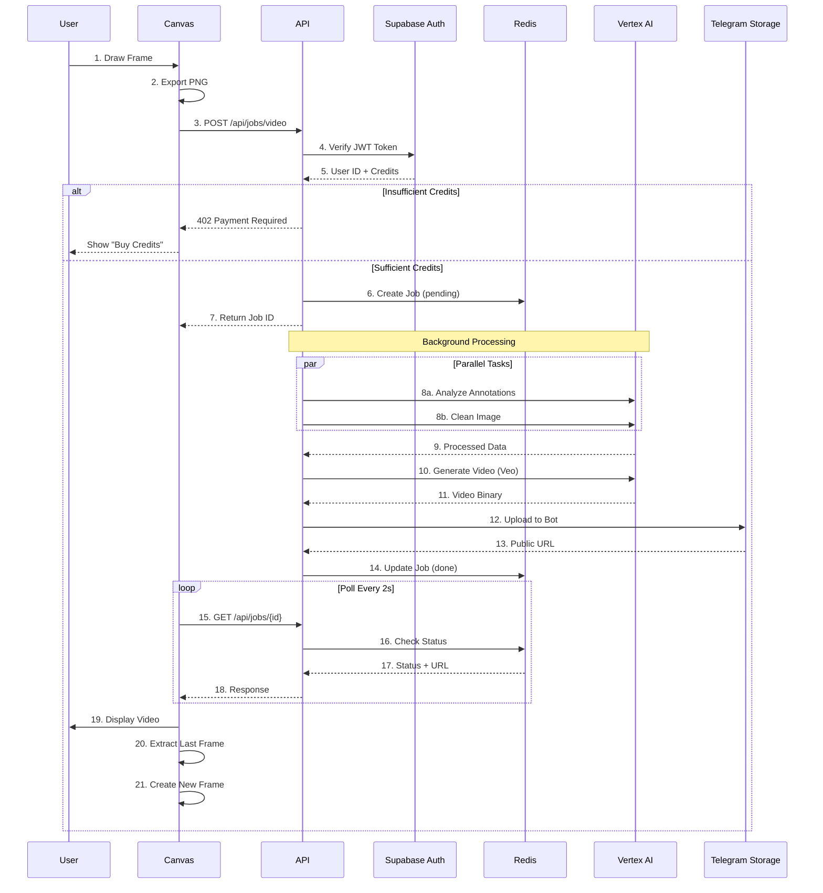
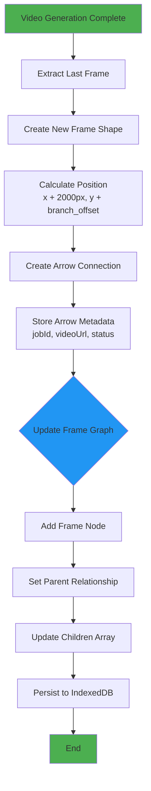
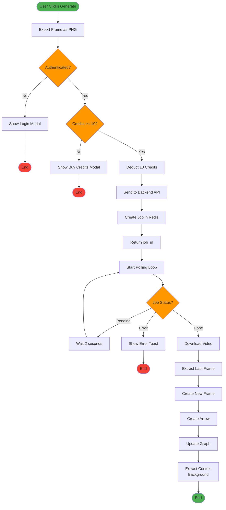
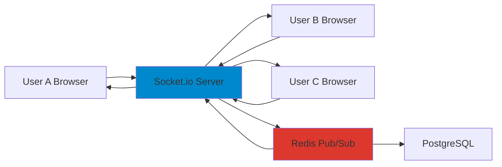

# Dream Flow AI 🎨✨

> **Transform Your Creative Vision into Dynamic Video Stories**

**Hack the Winter – The Second Wave | Round 2 Submission**

An AI-powered collaborative storyboarding platform that revolutionizes video content creation through intelligent frame-by-frame generation and context-aware scene understanding.

---

## 📋 Table of Contents
1. [Problem Statement](#-problem-statement)
2. [Proposed Solution](#-proposed-solution)
3. [System Architecture](#-system-architecture)
4. [Data Flow Diagrams](#-data-flow-diagrams)
5. [Flowcharts](#-flowcharts)
6. [Round 2 Improvements](#-round-2-improvements)
7. [Tech Stack](#-tech-stack)
8. [Installation](#-installation--setup)
9. [Demo Video](#-demo-video)
10. [Research & References](#-research--references)

---

## 🎯 Problem Statement

Content creators, filmmakers, and designers face significant challenges:

- **Time-consuming workflows**: Traditional video storyboarding takes 3-5 days per project
- **High production costs**: Professional video production costs $2000-5000 per minute
- **Technical barriers**: Requires expertise in video editing software (Adobe Premiere, After Effects)
- **Lack of collaboration**: No real-time tools for distributed teams
- **Poor visualization**: Difficult to preview scene transitions and narrative flow
- **No AI integration**: Manual frame-by-frame creation without intelligent assistance

**Market Gap**: Existing tools like Runway and Pika Labs generate videos but lack storyboarding workflows. Traditional tools like Storyboard Pro don't generate videos.

---

## 💡 Proposed Solution

**Dream Flow AI** is an intelligent canvas-based platform that bridges the gap between concept and creation:

### Core Features
1. **Sketch-to-Video Generation**: Draw rough sketches → AI generates polished 6-second video clips
2. **Context-Aware Memory**: AI remembers characters, style, and environment across frames
3. **Non-Linear Storytelling**: Branch narratives with multiple endings using graph-based system
4. **Auto-Merge Videos**: Combine clips into full sequences with one click
5. **Real-Time Collaboration**: Multiple users editing same canvas simultaneously (Round 2)
6. **Zero-Cost Storage**: Innovative use of Telegram Bot API as free unlimited CDN

### Innovation Highlights
- **Cost Reduction**: 90% cheaper than traditional video production
- **Speed**: 10x faster than manual storyboarding
- **Accessibility**: No video editing skills required
- **Scalability**: Free storage using Telegram Bot API (unlimited bandwidth)

---

## 🏗️ System Architecture

### High-Level Architecture Diagram




### Component Breakdown

**Frontend Layer:**
- **Canvas Engine**: Tldraw 3.15 for infinite canvas drawing
- **Frame Graph Manager**: Custom algorithm tracking frame relationships
- **Video Manager**: Polls job status, extracts last frames
- **Auth Context**: Supabase JWT authentication

**Backend Layer:**
- **API Gateway**: BlackSheep (Python) with async support
- **Job Service**: Redis-based async job queue
- **Vertex Service**: Google AI integration (Veo 3.1 + Gemini 2.5)
- **Storage Service**: Telegram Bot API for free unlimited storage

**Infrastructure:**
- **Redis**: Job queue + pub/sub for real-time features
- **Vertex AI**: Video generation (Veo) + image analysis (Gemini)
- **Telegram Bot**: Free CDN with 2GB file limit per video
- **PostgreSQL**: User data, credits, projects (via Supabase)

---

## 🔄 Data Flow Diagrams

### Video Generation Pipeline (DFD Level 1)




### Frame Graph Update Flow



---

## 📊 Flowcharts

### Video Generation Decision Logic




---

## 🎯 Round 2 Improvements

### 1. Real-Time Collaboration 🤝

**Architecture:**




**Features:**
- Live cursor tracking with user avatars
- Operational Transform (OT) for conflict resolution
- Presence indicators (who's online)
- Chat sidebar for team communication
- Version history with rollback

**Tech:** Socket.io, Redis Pub/Sub, CRDT  
**Timeline:** 2 weeks

---

### 2. Advanced AI Features 🧠

**Voice-to-Video:**
- Record voice descriptions → Whisper API → GPT-4 → Auto-generate frames

**Style Transfer:**
- Extract style from first frame → Apply to all subsequent frames
- Character face tracking using CLIP embeddings

**Smart Suggestions:**
- AI recommends next 3 scenes based on current narrative
- Detect missing transitions and auto-fill

**Tech:** Whisper, ControlNet, CLIP, GPT-4  
**Timeline:** 3 weeks

---

### 3. Professional Video Editor 🎬

- Drag-and-drop timeline
- Trim/split clips
- Transition library (fade, dissolve, zoom)
- Audio tracks (music, voiceover)
- Export: 720p, 1080p, 4K

**Tech:** FFmpeg filters, Web Audio API  
**Timeline:** 2 weeks

---

### 4. Performance Optimizations ⚡

- Edge caching with Cloudflare CDN
- WebAssembly for client-side image processing
- Database indexing for faster graph traversal
- Connection pooling (PgBouncer)

**Tech:** WASM, Cloudflare R2, PostgreSQL  
**Timeline:** 1 week

---

## 🛠️ Tech Stack

### Frontend
- **Framework:** React 18 + TypeScript
- **Canvas:** Tldraw 3.15
- **UI:** Radix UI + Tailwind CSS
- **State:** Context API + Custom Hooks
- **Routing:** React Router v7

### Backend
- **Framework:** BlackSheep (Python 3.11)
- **AI:** Google Vertex AI (Veo 3.1, Gemini 2.5)
- **Queue:** Redis (async job management)
- **Auth:** Supabase (OAuth + JWT)
- **Storage:** Telegram Bot API (free unlimited CDN)
- **Video:** FFmpeg (merging/processing)

### Infrastructure
- **Hosting:** Vercel (Frontend) + Railway (Backend)
- **Database:** PostgreSQL (Supabase)
- **CI/CD:** GitHub Actions
- **Monitoring:** Sentry (planned)

---

## 🚦 Installation & Setup

### Prerequisites
```bash
Node.js 18+
Python 3.11+
Redis
Telegram Bot Token
Supabase Account
```

### Backend Setup
```bash
cd backend
pip install -r requirements.txt
cp .env.example .env
# Fill in: TELEGRAM_BOT_TOKEN, REDIS_URL, SUPABASE_URL
python main.py
```

### Frontend Setup
```bash
cd frontend
npm install
cp .env.example .env
# Fill in: VITE_BACKEND_URL, VITE_SUPABASE_URL
npm run dev
```

---

## 🎥 Demo Video

**Link:** [YouTube Demo](https://youtu.be/placeholder)

**Timestamp Guide:**
- 0:00 - Introduction
- 0:30 - Drawing on canvas
- 1:00 - Video generation
- 1:30 - Frame graph branching
- 2:00 - Video merging
- 2:30 - Round 2 features preview

---

## 📚 Research & References

1. **Veo: Google's Video Generation Model**  
   https://deepmind.google/technologies/veo/

2. **Tldraw: Infinite Canvas Library**  
   https://tldraw.dev/docs

3. **Operational Transform for Real-Time Collaboration**  
   https://operational-transformation.github.io/

4. **FFmpeg Video Processing**  
   https://ffmpeg.org/documentation.html

5. **Redis Pub/Sub Pattern**  
   https://redis.io/docs/manual/pubsub/

6. **Frame Graph Algorithms**  
   https://en.wikipedia.org/wiki/Scene_graph

7. **Telegram Bot API Documentation**  
   https://core.telegram.org/bots/api

8. **WebSocket Real-Time Communication**  
   https://socket.io/docs/v4/

9. **CRDT for Conflict-Free Replication**  
   https://crdt.tech/

10. **Supabase Authentication**  
    https://supabase.com/docs/guides/auth

---

## 👥 Team Contributions

- **Your Name** - Project Lead, Backend Architecture, AI Integration
- **Ananya Sharma** - Frontend Development, Real-Time Collaboration
- **Rohan Patel** - Video Editor, Timeline Implementation
- **Priya Reddy** - Testing, Quality Assurance, Documentation

---

## 📝 License

MIT License

---

## 🙏 Acknowledgments

- Tldraw for the amazing canvas library
- Google Vertex AI for cutting-edge models
- Supabase for seamless backend infrastructure
- Telegram for free unlimited storage

---

**Built with ❤️ for Hack the Winter – The Second Wave**

**GitHub:** [Repository Link]  
**Live Demo:** [Coming Soon]
